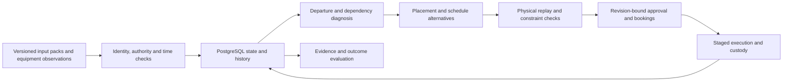

# Northstar · Terminal Recovery Lab

A container-terminal decision workbench for a shift planner deciding **which cargo to move, where to put it, and which equipment to book before departure cutoffs**.

A container can be late even when its destination is nearby: another load blocks access, a tractor is occupied, a receiving crane is unavailable, or the relocation would obstruct later work. Northstar connects those facts, compares executable recovery options, and follows the chosen plan through execution and failure.

**Python / FastAPI · PostgreSQL · React / TypeScript · OR-Tools CP-SAT**

All supplied operational data is synthetic. The database, ingestion, scheduling, controlled actions and evaluation are implemented; real-terminal benefit has not been validated. Runs locally without Docker or an LLM key.

[Follow one complete decision](docs/public/decision-case.md) · [Understand the design choices](docs/public/decisions.md) · [Inspect data and SQL](docs/public/data-and-sql.md) · [Review measured results](docs/public/validation.md)

## See the workflow

### 1. Find the work behind the risk


**Yellow 1:** relocate Container 122 out of A1. **Cyan 2:** retrieve Container 121 for North Rail. The map connects physical position to prerequisite work; these are instructed routes, not completed movements. The planner can challenge the prescribed relocation destination before booking a schedule.

### 2. Compare benefits and costs


In this synthetic reference case, recovery protects **17 rather than 16 of 24 outbound cargo**, with four changed assignments and more modeled travel. Those are terminal-wide totals. Compare other departures and equipment bookings before approving; the solver is not assumed to win.

### 3. Follow what actually happens


In a separate failure branch, **Container 123 remains on Terminal tractor 1** when the receiving yard crane becomes unavailable. Approval, future equipment bookings, current custody and completed departure are separate facts. An accepted failure interrupts execution without falsely recording arrival.

[The visual case study](docs/public/decision-case.md) connects each step to its inputs, SQL, implementation and user action. [The walkthrough](docs/public/walkthrough.md) gives the corresponding application steps.

## What is connected



The operational loop is **facts → relationships → feasible alternatives → approved action → observed outcome → feedback**. The assistant reads evidence from this system; it does not decide feasibility or authorize actions.

| Decision | Connected inputs | Output and boundary |
|---|---|---|
| What prevents this departure? | Cargo visits, commitments, stack positions, prerequisite jobs, releases | A traceable work chain; diagnosis does not dispatch equipment |
| Where should an obstruction move? | Capacity, incoming work, downstream retrieval, routes | Compared destinations; applying one changes instructions only |
| Which recovery schedule should run? | Deadlines, job order, equipment calendars, stage/resource constraints | Baseline, heuristic and bounded CP-SAT alternatives with replay checks |
| Can the approved work continue? | Current custody, receiver status, active schedule and bookings | Execution or explicit interruption; repair is not automatic reapproval |
| Did the strategy help? | Paired scenarios, actual simulated completion, harmed departures | Measured wins, ties, losses and unfinished work |

## Why the system is built this way

- **One transactional state boundary.** PostgreSQL stores operational relationships, commands, bookings and history. Recursive SQL traverses job dependencies without introducing a separate graph store that must stay synchronized.
- **Identity and obligation are different.** A physical container, its visit and its outbound commitment are separate concepts, so work and outcomes attach to the correct journey.
- **Planning is not physical truth.** Proposed destinations, equipment reservations and cargo custody remain distinct. This matters most when execution fails.
- **Optimization needs a baseline and a check.** A bounded solver searches generated options; independent physical replay can reject a candidate. Baseline remains available when alternatives are worse.
- **Inputs retain their provenance.** Duplicate, stale and conflicting deliveries remain inspectable without silently overwriting accepted facts.
- **The language model has limited authority.** Typed read-only evidence tools support explanation; no arbitrary SQL, approval or equipment dispatch.

Read [the design decisions](docs/public/decisions.md) for alternatives considered, costs and implementation references. [Data and SQL](docs/public/data-and-sql.md) explains keys, many-to-many dependencies, temporal occupancy, indexes and current versus historical state.

## Evidence and limitations

The published connected-movement evaluation contains **8 synthetic scenario families × 3 strategies = 24 attempts**. Each recovery strategy has **4 wins, 3 ties and 1 loss** against baseline. In the handling-calendar case, baseline serves 14 cargo on time and the alternatives serve 13. The result remains published.

Verification includes API/database tests, a Linux CI build and browser smoke, an upgrade check, process restart, external duplicate delivery and an isolated restore matching **38 tables / 2,991 rows** at the tested release. [Validation](docs/public/validation.md) records versions and limits; [machine-readable results](docs/public/validation-results.json) retain source fingerprints.

These checks establish behavior under authored assumptions, not real-terminal ROI or calibrated uncertainty. Placement comparison can be slow on a small laptop; the published five-destination check took roughly 75 seconds. No hosted application, real TOS connector or physical equipment writeback is provided.

## Read the project

| Document | Question it answers |
|---|---|
| [Complete decision](docs/public/decision-case.md) | How does a planner get from a blocked container to a controlled action? |
| [Design decisions](docs/public/decisions.md) | Why these boundaries and technologies, and what did they cost? |
| [Data and SQL](docs/public/data-and-sql.md) | How do records become connected decision evidence? |
| [Architecture](docs/public/architecture.md) | Where do the components and state transitions live? |
| [Validation](docs/public/validation.md) | What was measured, what failed, and what remains unproven? |
| [Real-data adoption](docs/public/real-data-adoption.md) | What data and operator validation would a real deployment require? |
| [Equipment integration](docs/public/integration.md) | How does an independent observation safely change state? |
| [Deployment and recovery](docs/public/deployment.md) | How is the application configured, protected and restored? |

## Run locally

Prerequisites: **Python 3.11+, Node.js 22.12+ and PostgreSQL 17**. Use a dedicated project database.

```bash
python3 -m venv .venv
.venv/bin/pip install -r requirements.lock.txt
cd frontend
npm ci
npm run build
cd ..
PG_BIN=/path/to/postgresql/bin ./scripts/start.sh
```

`PG_BIN` is the directory containing `initdb`, `pg_ctl` and `psql`. Common Homebrew PostgreSQL 17 installations are detected automatically. The helper initializes its own local cluster on **55432** and saves generated credentials under ignored `.local/`.

Open **http://127.0.0.1:8790**. The shift starts paused. Stop the API with Ctrl+C; `./scripts/stop.sh` also stops the project database.

For an existing dedicated PostgreSQL database, export `DATABASE_URL`, then run:

```bash
.venv/bin/python -m uvicorn app.api:app --host 127.0.0.1 --port 8790
```

Startup applies the migrations. Do not point this application or its integration tests at another application's database. For frontend development, run `npm run dev` in `frontend` with the backend running. API documentation is available at `/docs`.

## Code map

| Directory | Purpose |
|---|---|
| `app/` | API, domain rules, ingestion, planning, execution, persistence and assistant |
| `frontend/src/` | Connected case workspace, terminal map, schedule lanes and evidence |
| `migrations/` | Ordered PostgreSQL schema migrations and integrity constraints |
| `sql/` | Diagnosis, placement, scheduling and evaluation queries |
| `datasets/` | Versioned synthetic inputs and source contracts |
| `evaluation/` | Authored evaluation scenarios |
| `tests/` | Domain, API, persistence, planning and reconciliation coverage |
| `scripts/` | Launch, validation, integration rehearsal and recovery tools |

## Verification

Stop the API before integration tests so its background workers do not compete with test workers. Keep the dedicated PostgreSQL cluster running.

```bash
./scripts/local-db.sh start
.venv/bin/python -m pytest tests -q --tb=short
.venv/bin/python -m scripts.dataset validate movement-shift
cd frontend
npm run build
```

The original release passed **145 backend tests** and the production frontend build. The finishing pass retires four tests belonging exclusively to the archived SQLite prototype; the current application retains 141 tests. See the validation record for the finishing-pass verification. A source-only installation, upgrade from the preceding schema, API-process restart and isolated PostgreSQL restore were also checked. See [validation evidence](docs/public/validation.md) for exact scope, measured results and limitations.

Evaluation scripts create their local output directories. Run the new movement suite with:

```bash
.venv/bin/python scripts/evaluate.py --suite movement
```

This runs eight synthetic families across three strategies. Plan-building is CPU-heavy on small laptops; run evaluations separately from interactive placement reviews.

`audit_evaluation_sql.py` requires the holdout report generated by the evaluation script. Browser scripts under `frontend/scripts/` use Playwright and may create retained synthetic runs.

## Optional assistant

The evidence fallback works without credentials. For OpenAI, export `TERMINAL_ASSISTANT_PROVIDER=openai` and `OPENAI_API_KEY` locally before launch. See `.env.example`; the launch script does not automatically load `.env`. Provider quality has not been validated with live paid-model evaluation.

## Scope and limitations

This is an operational decision prototype, not a production terminal operating system. It has no live TOS/AIS integration or physical equipment writeback. Travel rates, equipment envelopes and handling times are authored assumptions. Evaluation measures synthetic behavior, not calibrated confidence or real-terminal ROI.

The deployment is a single API process with local background workers. Authentication is a local administrator mechanism, not enterprise identity. Scheduling searches a bounded option set; crane redeployment, general time-window routing and automatic replanning are not implemented. Dataset and historical evidence retention have not been validated at enterprise scale.
