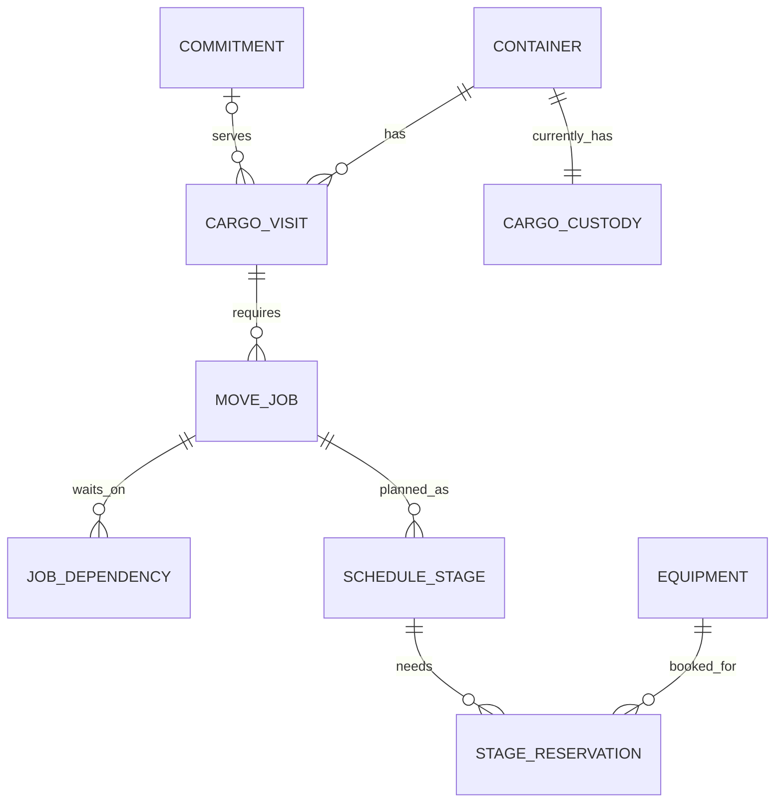

# Data model and SQL

The model connects operational facts to two decisions: where to relocate obstructing cargo, and how to schedule the required work before departure cutoffs. All supplied operational records are synthetic. Versioned file packs make the assumptions inspectable and repeatable; the separate equipment sender exercises an ingestion boundary with synthetic observations.

## Relationships and grain

This is a conceptual relationship diagram, not a claim that the prototype stores an unlimited history of every container's visits. A dependency row references both a job and a predecessor job. Locations supply the source and target of work and may hold cargo; equipment can hold cargo during transfer.

| Record | Grain and purpose | Important relationship |
|---|---|---|
| `runs` | One isolated operational scenario | Revision and clock define its current state |
| `containers` | One physical container per run | Current visit, commitment and location projection |
| `cargo_visits` | One modeled cargo journey | Links cargo to an outbound commitment |
| `commitments` | One service obligation | Destination and cutoff |
| `move_jobs` | One required movement | Cargo, visit, source, target and assignment |
| `job_dependencies` | One directed prerequisite edge | Job-to-job many-to-many relation |
| `equipment_windows` | One availability interval | Machine and modeled operating calendar |
| `stage_reservations` | One equipment booking for a plan/job/stage | Approved use, not physical ownership |
| `cargo_custody` | One current holder per container | Exactly one location or equipment holder |
| `feed_receipts` | One received delivery | Includes duplicates and rejected application outcomes |
| `snapshots` / `events` | One revision snapshot / one recorded event | Historical evidence and command/source attribution |

Most operational identifiers are scoped by `run_id`. Composite primary and foreign keys prevent a relationship from accidentally pointing into a different scenario. The dependency table's composite key prevents duplicate edges; its self-edge check is not a general cycle detector.

See [migrations](../../migrations/) for exact columns and constraints. JSONB retains attributes and exact state alongside normalized relationship columns. This is a deliberate hybrid, with duplicated projections that must be maintained transactionally—not a fully normalized schema or a pure event-sourced architecture.

## Inputs become decision evidence

| Input | Operational influence |
|---|---|
| Inventory, location and stack order | Determines whether cargo is accessible and which relocation is required |
| Work orders and dependencies | Establishes prerequisite order and the set of cargo affected by a delay |
| Commitments, cutoffs and service windows | Defines readiness, lateness and schedule priorities |
| Equipment capabilities and calendars | Limits compatible assignments and feasible intervals |
| Directed routes and handling assumptions | Determines empty repositioning, loaded travel and stage duration |
| Release and status observations | Can block dispatch or invalidate an approved plan |

`app/datasets.py` validates and assembles packs; `app/feed.py` reconciles observations. A field's presence is not enough: identity, authority and timing govern whether it is accepted. Read [dataset contracts](../../datasets/README.md) for pack contents and validation.

## Query 1: why is this cargo blocked?

[`diagnosis_dependencies.sql`](../../sql/diagnosis_dependencies.sql) produces one row per outbound visit. It selects current relational entities or historical snapshot entities, identifies final outbound jobs, recursively follows predecessors, and aggregates unique work plus evidence.

The recursive row is `(root_id, id)`. `UNION` removes repeated root/ancestor pairs, so a diamond-shaped dependency does not count shared work twice. This also terminates cycles for this finite pair set; adding a changing depth column would change that property. Termination is not proof that the operational dependency graph is valid.

Edges and position mismatches are aggregated separately. Joining cargo, edges and equipment into one wide intermediate result could multiply rows and inflate counts. A mismatch is suppressed when an unfinished predecessor legitimately brings the same container to its planned pickup.

`app/diagnosis.py` combines these relationships with domain rules and accepted observations to explain readiness. The query establishes scope; it does not optimize a schedule.

## Query 2: where could the obstruction go?

[`placement_candidates.sql`](../../sql/placement_candidates.sql) follows downstream jobs, aggregates inventory and incoming work separately, excludes unsupported destinations and ranks a bounded shortlist. The coarse shortlist uses coordinate distance; the movement model subsequently calculates directed route/stage behavior and replays candidate schedules. The shortlist rank alone is not a physically validated recommendation.

The relevant question is not just “is there room?” It is also “would this cover committed cargo, create later work, or shift delay to another service?” `app/placement.py` compares candidates and `app/placement_store.py` saves revision-bound evidence. Approval checks state again and changes instructions atomically.

## Query 3: will there be room when the cargo arrives?

[`placement_temporal.sql`](../../sql/placement_temporal.sql) starts with observed inventory, adds scheduled pickup changes of −1 and arrival changes of +1, aggregates simultaneous boundaries, and computes a running sum partitioned by location. `LEAD` gives the end of each occupancy interval.

For example, a yard with 3 containers, a pickup at minute 10 and an arrival at minute 14 has projected occupancy 3 → 2 → 3. If both changes occur at minute 10, they are combined before the running sum; ordering individual rows would create an artificial transient result.

The profile is conditional on candidate execution. It does not remove a container from current inventory just because a pickup was scheduled. `app/placement_store.py::create` checks the SQL profile against capacity after physical replay and refuses disagreement.

## Booking constraints and transaction boundaries

PostgreSQL range exclusion constraints prevent overlapping active equipment reservations; application guards also check operational feasibility. Custody uses an exclusive location/equipment choice and a deferred unique equipment-holder constraint. Deferral allows a valid release/acquire handover to complete inside a transaction before checking exclusivity.

A revision-bound command cannot silently approve a comparison made against old state. Persistence writes projections, snapshots and events together. Receipt acknowledgment likewise follows commit. These are correctness boundaries, not just storage implementation details.

## Current state, history and indexes

Current queries use run-scoped typed tables. Historical diagnosis reads the requested snapshot rather than joining old cargo to today's assignments. This prioritizes reproducibility, at the cost of JSON unpacking and retained snapshots. It is not a complete bitemporal database or unlimited-retention design.

Existing indexes include container location, job status/source/target/visit, reverse dependency lookup and entity event history. Primary keys support run-scoped identity joins; GiST constraints serve interval overlap. Index selection follows the actual predicates and traversal direction. Adding indexes everywhere increases write costs and does not solve full-snapshot persistence or expensive candidate simulation.

[`scripts/benchmark_reads.py`](../../scripts/benchmark_reads.py) records sizes, latency and an analyzed query plan. The published measurements increase stored shifts, not the size of one scheduling problem. Larger-terminal claims would require representative data volumes, query-plan inspection and separate planner profiling.
