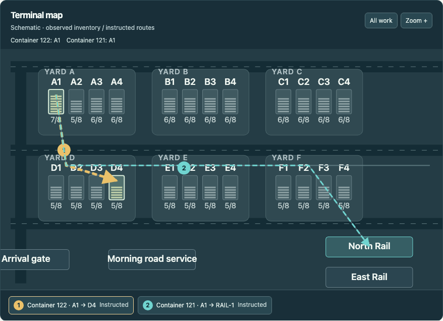
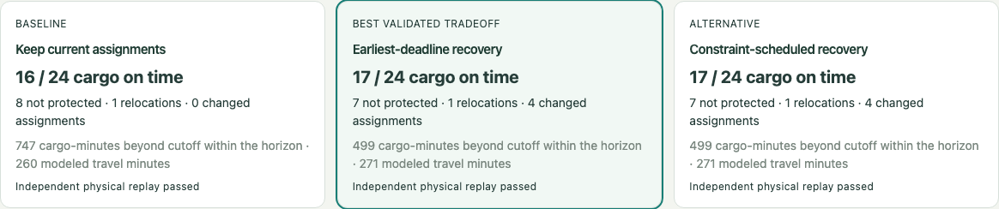
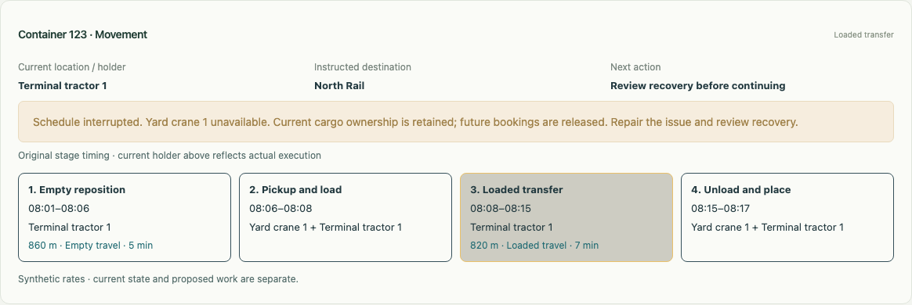

# Product walkthrough

All positions, durations and observations below are synthetic. Start from a fresh input pack so completed work from an older run does not obscure the decision.

## 1. Recover North Rail

1. In Scenario lab, import **Connected movement shift**. Leave its clock paused.
2. In Operations, select **North Rail**, then **Container 121**. The map shows its current stack and the preceding relocation of Container 122.
3. Open **Required work**. Trace the ordering, source/destination and equipment roles. An assigned machine, a future booking and the current cargo holder describe different things.
4. Compare destinations for the relocation. Inspect capacity over time, downstream retrieval and route costs. The prescribed destination may remain the best supported choice. Applying a destination changes instructions, not physical positions.
5. Open **Compare & book**, build alternatives and inspect each strategy's outcome and equipment lanes. Compare harm to other departures as well as the selected rail service. A rejected candidate cannot be booked.
6. Approve a feasible schedule. In **Execution**, step the clock and follow actual pickup, transfer and setdown. Approval is not completion.
7. Inspect Evidence for the revision, command and execution records supporting the result.





## 2. Interrupt an approved move

For an automated, independently delivered observation, follow [the equipment integration guide](integration.md). `scripts/rehearse_integration.py` uses a fresh movement shift, books a feasible deadline schedule, advances eight minutes, sends a receiver failure and repeats the same event. It asserts that execution is interrupted and cargo custody is retained.

```bash
# Server must already be configured for this run/token.
.venv/bin/python scripts/rehearse_integration.py --run YOUR_RUN_ID
```

Open that run in Operations → Execution. Inspect the current holder and failed receiver, then the changed equipment reservations. The **Scenario lab → Input packs** panel shows applied/duplicate receipts; select the equipment to inspect affected work. The clock does not advance simply because an observation arrived.

Repair through the supported scenario controls, inspect the remaining work and compare again where permitted. Repair is not automatic approval of an old plan. A fresh comparison can correctly refuse to plan while an in-progress load still has an unknown completion time.



## 3. Understand a losing or impossible outcome

Import **Impossible cutoff** to inspect an explicitly infeasible original-model departure, or run **Connected movement** evaluation for the new model's impossible-cutoff case. The interface must distinguish unserved cargo from a successful departure and show which assumptions made recovery impossible.

In **Scenario lab → Evaluation**, inspect the connected movement suite. It compares eight scenario families and three strategies (24 attempts). Durations in this model are deterministic; repetitions with different seeds would not constitute independent physical uncertainty samples.

Inspect coverage, interruptions, wins/losses and harmed departures before comparing headline averages. Open the JSON report for scenario definitions, model/source hashes and per-trial evidence. The legacy stress suite is regression evidence, not a permanently untouched holdout.

## Reviewing the engineering

Follow `app/integration.py` into `app/feed.py` and `app/store.py` for source-to-state transactions. Read `sql/input_impact.sql` for connected exposure, `sql/placement_temporal.sql` for projected capacity and `app/stage_planning.py` for schedule constraints and independent replay. `app/evaluation_store.py` persists the measured outcomes without mutating the operational run.

The app has no live equipment control or automatic replanning. Its value is an inspectable decision loop with explicit assumptions and failure outcomes.
